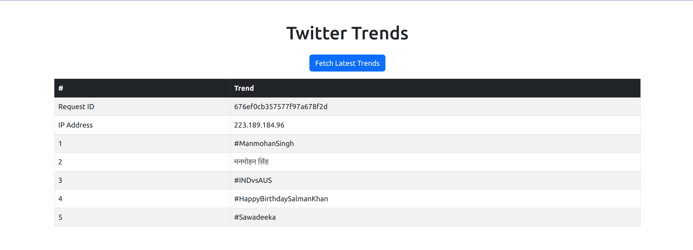
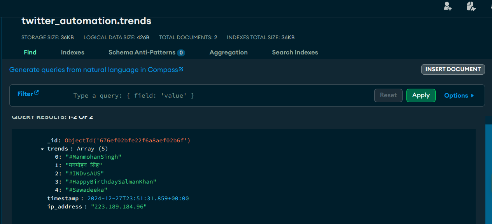

# Twitter Trends Fetcher

A Flask web application that fetches and displays the top 5 trending topics from Twitter using Selenium for web scraping and MongoDB for data storage.

## Features

- Fetches current trending topics from Twitter
- Displays trends in a clean web interface
- Stores trend data in MongoDB with associated IP addresses
- Uses proxy support for reliable scraping using proxymesh

## Prerequisites

- Python 3.8 or higher
- Chrome browser installed
- MongoDB instance (local or Atlas)
- Twitter account credentials
- Proxy server details (ProxyMesh)

## Installation

1. Clone the repository:
```bash
git clone <repository-url>
cd twitter-trends-fetcher
```

2. Create and activate a virtual environment:
```bash
python -m venv venv
# On Windows
venv\Scripts\activate
# On Unix or MacOS
source venv/bin/activate
```

3. Install dependencies:
```bash
pip install -r requirements.txt
```

4. Create a `.env` file in the root directory and fill in your credentials:
```plaintext
PROXY_USERNAME = "your_proxy_username"
PROXY_PASSWORD = "your_proxy_password"
PROXY_HOST = "your_proxy_host"
PROXY_PORT = "your_proxy_port"
TWITTER_USERNAME = "your_twitter_username"
TWITTER_PASSWORD = "your_twitter_password"
TWITTER_EMAIL = "your_twitter_email"
MONGODB_URI = "your_mongodb_connection_string"
```

## Project Structure

```
twitter-trends-fetcher/
├── app/
│   ├── __init__.py
│   ├── routes.py
│   ├── services/
│   │   ├── selenium_service.py
│   │   └── mongodb_service.py
│   └── templates/
│       ├── layout.html
│       └── index.html
├── .env
├── requirements.txt
└── run.py
```

## Running the Application

1. Ensure all environment variables are properly set in the `.env` file

2. Start the Flask application:
```bash
python run.py
```

3. Open your web browser and navigate to:
```
http://localhost:5000
```

## Usage

1. Open the homepage in your web browser
2. Click the "Fetch Latest Trends" button
3. The application will:
   - Log into Twitter using provided credentials
   - Fetch the current trending topics
   - Store the data in MongoDB
   - Display the trends on the webpage





## Error Handling

The application handles various error scenarios:
- Failed Twitter login attempts
- Network connectivity issues
- MongoDB connection problems
- Proxy configuration errors

Error messages will be displayed on the web interface if any issues occur.

## Contributing

1. Fork the repository
2. Create a feature branch
3. Commit your changes
4. Push to the branch
5. Create a Pull Request

## License

This project is licensed under the MIT License - see the LICENSE file for details.
